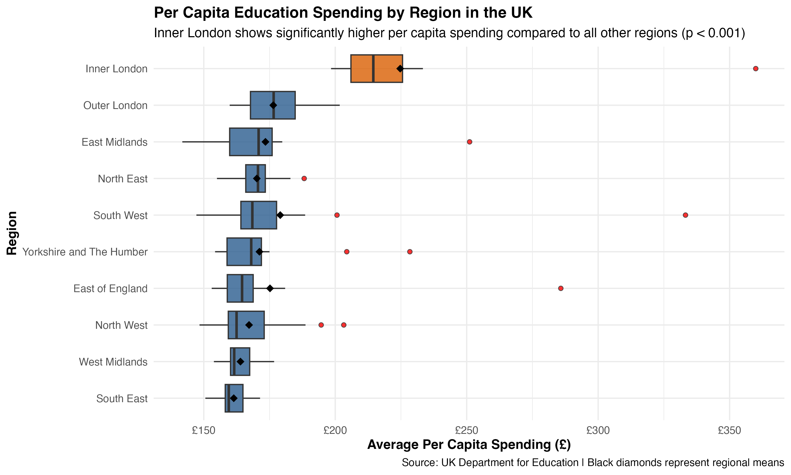
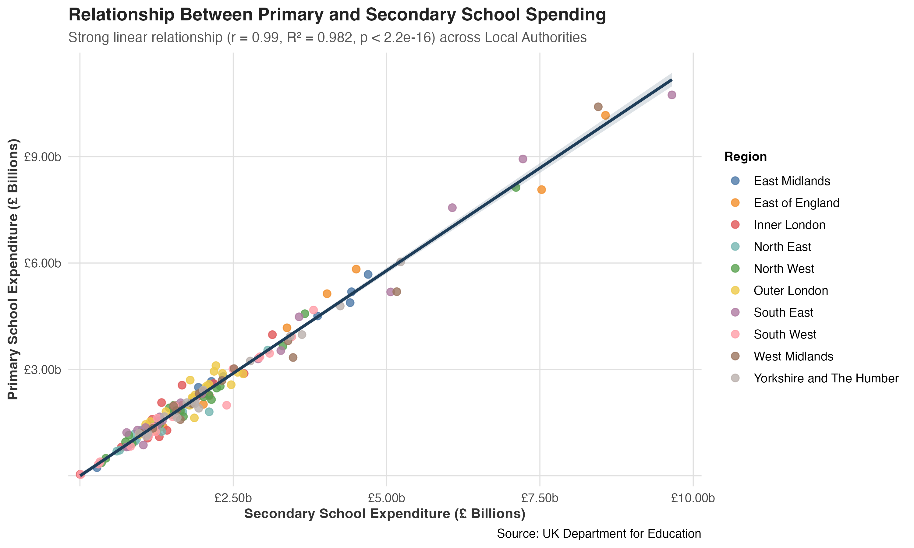
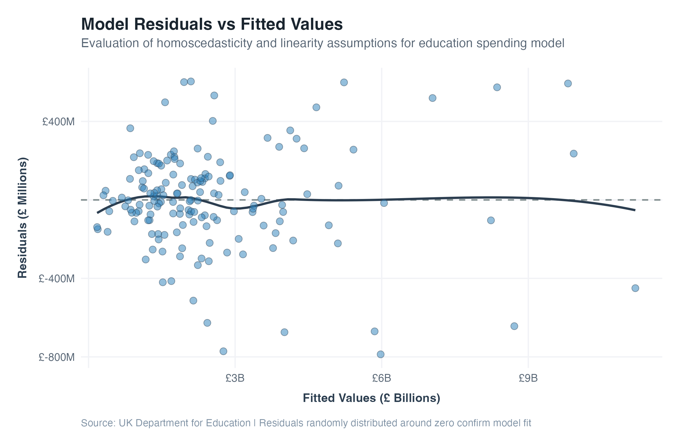

# UK Public Education Expenditure Analysis (2024-25)
This repository contains an empirical evaluation of public education spending across English Local Authorities for the 2024-25 financial year, using official data published by the UK Department for Education (DfE). 

The primary objective is to investigate structural allocation patterns, identify regional funding disparities, and test the linear stability of primary versus secondary school expenditure. The workflow covers the full analytical pipeline, from raw data cleaning and statistical testing to predictive modeling and visual diagnostics.

---

## Dataset & Scope
The analysis uses unrounded, planned expenditure data aggregated at the Local Authority level. The cleaned dataset isolates financial metrics across key operational areas:

- **Net Planned Expenditure:** Allocations dedicated to primary and secondary institutions.
- **Per Capita Metrics:** Average per-student spending per authority.
- **Geographic Groupings:** Regional classifications spanning 10 English regions.

---

## Key Findings & Methodology

### 1. Regional Disparities & ANOVA
A One-Way ANOVA was conducted to evaluate whether mean per-capita spending differs across regions. Post-hoc comparisons using the Tukey HSD test confirmed that Inner London maintains a statistically significant higher allocation compared to every other region ($p < 0.001$). 



---

### 2. Primary vs. Secondary Funding Coherence
A Pearson correlation test and linear regression were applied to evaluate proportional spending behavior across authorities. The analysis revealed a near-perfect linear relationship ($r = 0.99$, $R^2 = 0.982$, $p < 2.2 \times 10^{-16}$), indicating highly synchronized budget distribution across educational tiers regardless of authority size.



---

### 3. Model Diagnostics & Assumptions
To confirm the reliability of the multiple linear regression model, variance inflation factor (VIF) metrics were checked for multicollinearity, and residual distributions were evaluated. Diagnostic plots show residuals randomly scattered around zero with stable variance, validating both homoscedasticity and linearity assumptions.



---

## Technical Stack
- **Language:** R (v4.x)
- **Data Manipulation:** `tidyverse` (`dplyr`, `readr`, `stringr`)
- **Statistical Modeling:** `car` (VIF diagnostics), base `stats` (`aov`, `TukeyHSD`, `lm`)
- **Data Visualization:** `ggplot2`, `scales`, `ggpubr`

---

 **Clone the repository:**
   ```bash
   git clone [https://github.com/thaylamaciel/uk-education-spending-analysis.git](https://github.com/thaylamaciel/uk-education-spending-analysis.git)
   cd uk-education-spending-analysis


## Repository Structure

```text
├── uk_education_spending_analysis.R    # Complete analytical script
├── raw_spending_data_cleaned.csv        # Cleaned dataset ready for reproduction
├── fig1_regional_per_capita_spending.png
├── fig2_primary_vs_secondary_spending_updated.png
├── fig3_model_residuals_publication.png
├── LICENSE                              # MIT License
└── README.md                            # Documentation


